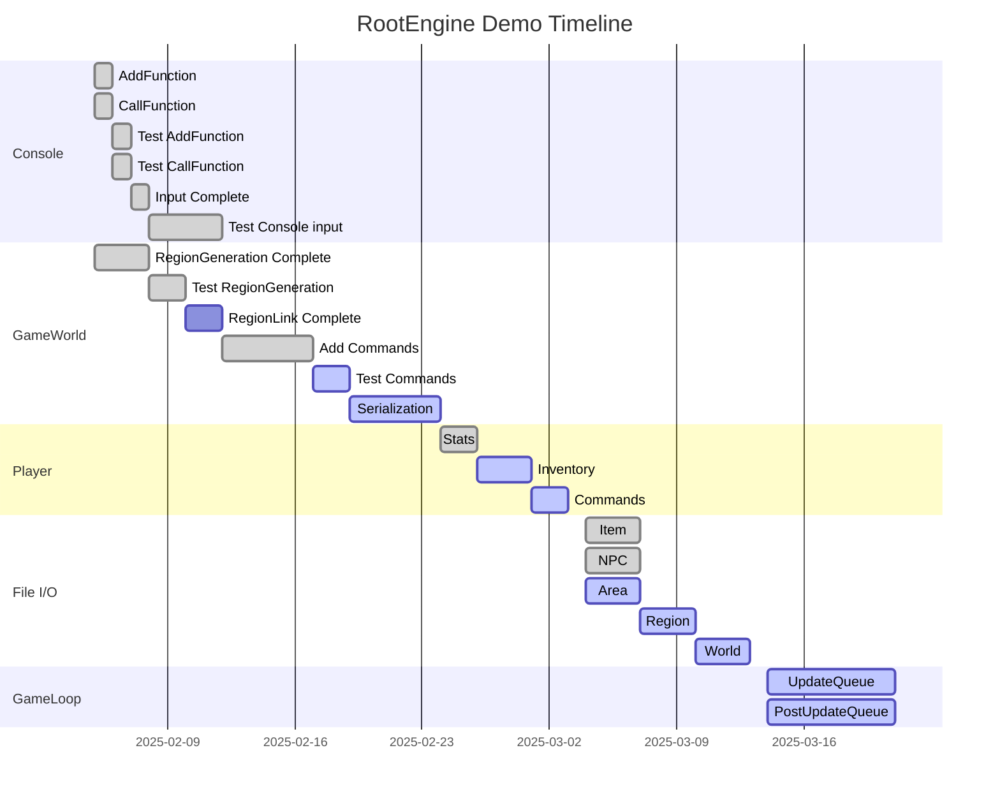

```mermaid
gantt
    title RootEngine Demo Timeline
    dateFormat DD-MM-YYYY
    section Console
        AddFunction: done, a1, 05-02-2025, 1d
        CallFunction: done, a2, 05-02-2025, 1d
        Test AddFunction: done, after a2, 1d
        Test CallFunction: done, after a2, 1d
        Input Complete: done, 1d
        Test Console input : done, 4d
    section GameWorld
        RegionGeneration Complete: done, b1, 05-02-2025, 3d
        Test RegionGeneration: done, after b1, 2d 
        RegionLink Complete: 2d
        Add Commands: done, 5d
        Test Commands: active, 2d
        Serialization: active, 5d
    section Player
        Stats: done, 2d
        Inventory: active, 3d
        Commands: active, 2d
    section File I/O
        Item: done, d1, 04-03-2025, 3d
        NPC: done, d2, 04-03-2025, 3d
        Area: active, d3, 04-03-2025, 3d
        Region: active, d4, after d3, 3d
        World: active, d5, after d4, 3d
    section GameLoop
        UpdateQueue: active, e1, 14-03-2025, 7d
        PostUpdateQueue: active, e2, 14-03-2025, 7d

```

# RenderPipeline: C

# Roots Engine: C/C++